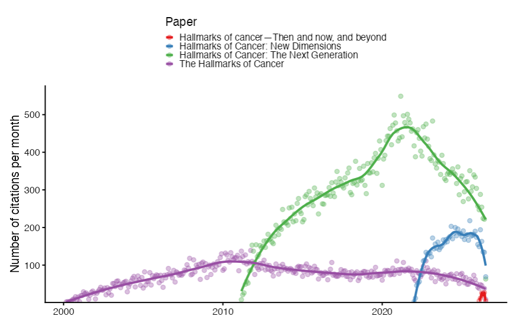

# OpenAlex Citation Trajectories

Project documentation lives under [`docs/`](docs/).

Start with [`docs/index.md`](docs/index.md) for the quickstart, workflow overview, and links to the rest of the project documentation.

Example with the Hallmarks of Cancer papers:

